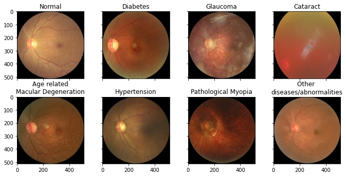

# <h1 align="center">Ocular Disease Recognition</h1>

    Alan Adamiak, Antoine Barbannaud, Sara Droussi, Maya Gawinowski, Ramdane Mouloua, Romain Mussard

Ceci est le repo GitHub du projet de reconnaissance de maladies oculaires.

    

L'architecture du projet est tirée du [Pytorch Project Template](https://github.com/moemen95/Pytorch-Project-Template), et nous avons également tiré de nombreuses fonctions des librairies PyTorch et scikit-learn. Nous enregistrons le meilleur modèle en fonction de la valid accuracy, vous retrouverez nos résultats dans des CSV et les `config.json` utilisés dans le dossier `visualisation/rapport/csv`.

---
## Installation des packages

Pour avoir tous les package utilisés ainsi que les versions correspondantes, utilisez:
`pip3 install -r requirements.txt`.

---
## Preparation
Pour pouvoir exécuter le programme qui se trouve dans le main, il faut d'abord appliquer un preprocessing. Le preprocessing se trouve dans le dossier utils ( ou bien à la racine en raison de bugs pour certains sur windows). Il faut d'abord décompresser l'archive du projet, et le mettre dans un dossier par exemple "data", et dans le fichier plot.py dans le main, il faut alors préciser le maths, du csv, des données bruts

Des fichiers CSV et de nouvelles images sont alors générées. Les chemins des fichiers CSV générés sont alors à reporter dans "data_dir" de config.json et le chemin pour les images dans "image_dir".

Pour ne pas avoir à modifier manuellement les chemins de lecture et d'écriture nous vous recommandons de décompresser le dataset en faisant en sorte d'avoir les images d'entrainement dans `data/ODIR-5K/ODIR-5K/Training Images` et le fichier xlsx qui décrit les données dans `data/ODIR-5K/ODIR-5K/data.xlsx`

Toutefois, si le preprocessing ne marche pas, vous pouvez telecharger les images pré-traités [ici](https://mega.nz/file/1lhkDJhQ#mWqVa9TpHKEHM_BTN8EfCWxjL1eFNlxYh9fGUwoRMF4) et les CSV [ici](https://mega.nz/file/UwpmBRyQ#_Ygfeoiw6DksUEi2zlJ8pm1YKQ3MywXuubloDhVyBk0).

## Execution d'une configuration

L'execution ce fait depuis la racine du projet selon la ligne de commande `python main.py -c config.json`

:warning: Deux modèles utilisent une donnée supplémentaire telle que le sexe ou l'âge: **mymodel** et **myAlexnet**. Il faut alors mettre "extended" à true dans le `config.json` pour utiliser les bons Data et Trainer.

:warning: La varibale `validation_split` si `equal_dist == True` ne correpsond pas toujours au véritable découpage du set de validation. En effet pour éviter d'avoir plus d'image de certaines classes dans notre set de validation que dans le set d'entrainement, le dataloader limite la proportion d'image de chaque classe à 1/3 maximum. La véritable `validation_split` est cependant afficher dans le terminale. Acutellement `validation_split = 0.15` donne un split de 10%. (Il aurait été simple de modifier le dataloader pour que le split donnée soit respecté mais nous avons choisit de laisser ce "bug" pour que les résultats présentés dans notre rapport soit reproductibles, la correction sera certainement apporté entre temps sur le github)

Le champs `dataAug` permet d'activer ou non la data augmentation, `equal_dist` d'avoir une répartition la plus équitable possbile des classes dans la validation.

Les autres options sont les mêmes que pour les autres procédures classiques de CNN, tel que le batch etc. Une fois toute ces étapes terminées on peut alors exécuter le programme.

## Tensor board
`tensorboard --logdir saved/log/`

`python main.py -c config.json`

`python plot.py -c config_plot.json`

Dans config.js il faut mettre tensorboard à true , puis pour suivre l'évolution, on peut doit alors taper dans un autre terminal en parallèle:

`tensorboard --logdir saved/log/`

On peut faire la même chose mais en affichant les CSV grâce à la classe plot.py, il suffit alors de reporter dans le fichier config_plot.json, les valeurs pour pour data_loader et model, ensuite il faut reporter le bon chemin pour model_path et affiche ( qui dépend de config.js), puis on peut alors affichier en exécutant, dans le dossier visualisation:

`python plot.py -c config_plot.json`

On peut alors afficher trois figures, le loss en fonction de l'époque, l'accuracy en fonctrion de l'epoque ou encore la matrice de confusion. (Attention, la metrics est ici généré une fois le modèle chargé, bien faire correspondre config_plot.json et le config.json enregistré ).
